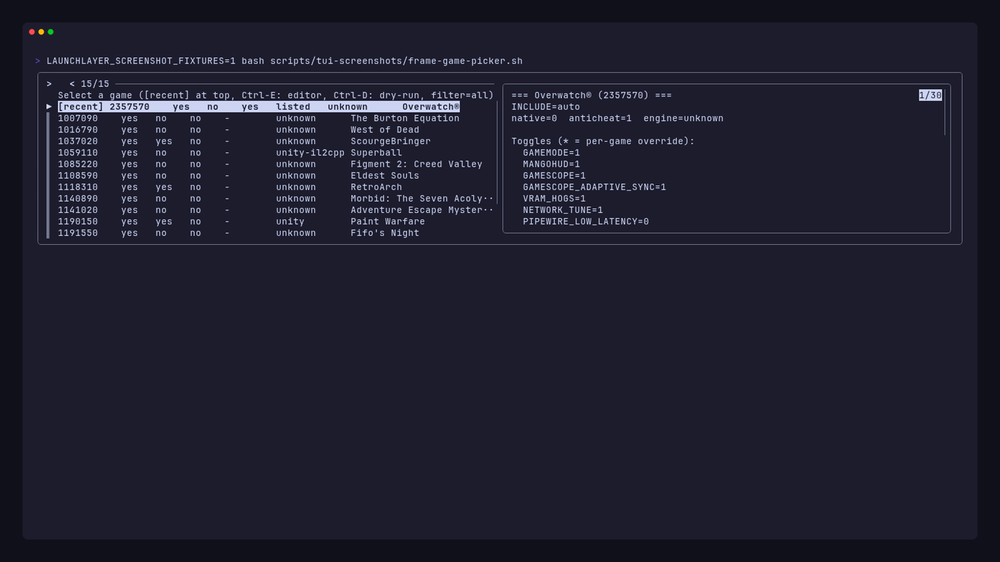
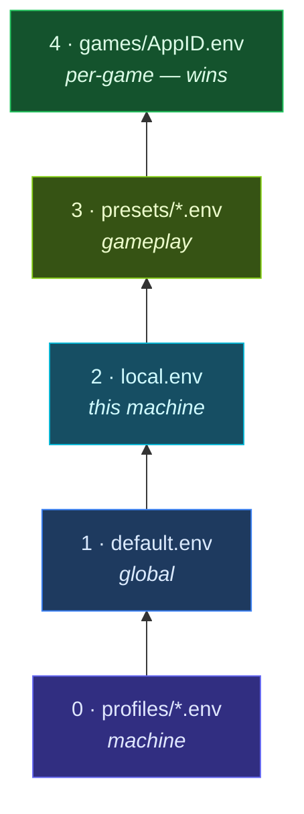
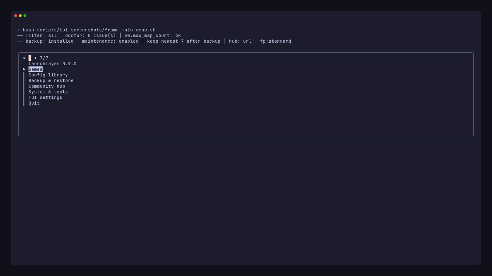
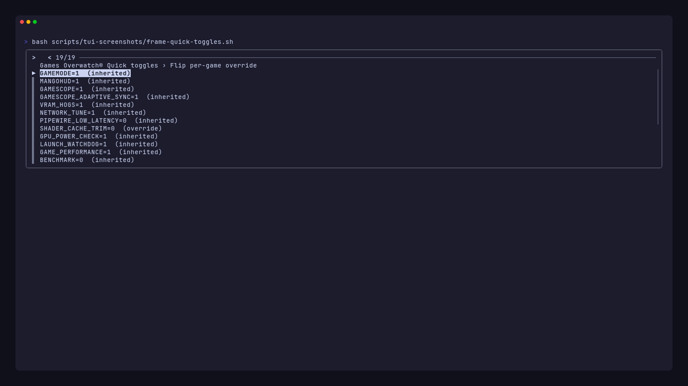

<div align="center">


# LaunchLayer

**Layered launch orchestration for Steam games on Linux**

*One Steam launch string. Per-game configs. GameMode, Gamescope, MangoHUD, and more — assembled automatically.*

[](LICENSE)
[](https://github.com/bolens/LaunchLayer/actions/workflows/ci.yml)
[](launchlayer)
[](launch.d/profiles/)

</div>

**For Linux gamers** who tune every launch — GameMode, CPU affinity, MangoHUD, Gamescope, VRAM hogs, network latency — but do not want a different Steam launch string per title.

LaunchLayer sits in Steam’s **Launch Options** ahead of `%command%`. It loads layered config, runs preflight checks, and builds the wrapper chain before your game starts.

| Without LaunchLayer | With LaunchLayer |
|---------------------|------------------|
| `gamemoderun mangohud gamescope -W 3440 … %command%` pasted per game | `"/path/to/launchlayer" %command%` once per game |
| Settings scattered across Steam, shell aliases, and one-off scripts | Plain `KEY=VALUE` files: profiles → presets → per-game |
| No preflight for `vm.max_map_count`, shader bloat, or VRAM pressure | Doctor, cache trim, compositor-aware display detection |

Built for a tuned workstation (7900X3D, RTX 3080 Ti, Wayland / Plasma 6), with auto-detection and profiles for Steam Deck, Flatpak Steam, BSD, and WSL2.

**Requirements:** bash 4.2+, Steam (or any launcher that passes `%command%`). Optional tools (`fzf`, `gamescope`, …) enhance the stack but are not required for basic launches.

### See it work

Preview the resolved layers and launch chain without starting a game:

```bash
./launchlayer --show-config 2357570
```

```
=== Config for AppID 2357570 (Overwatch®) ===
Layers:
  → profiles/arch-linux.env
  → profiles/nvidia-desktop.env
  → default.env
  → presets/competitive.env
  → games/2357570.env

Launch chain:
  gamemoderun → taskset → game-performance → dlss-swapper → gamescope → %command%
```

<p align="center">
  
  <br>
  <em><a href="docs/tui.md#screenshots">Interactive TUI</a> — browse games, preview configs, flip toggles</em>
</p>

### Quick paths

| I want to… | Go to |
|------------|-------|
| Get running in five minutes | [Quick start](#quick-start) |
| Paste into Steam’s Launch Options | [Steam integration](#integrating-with-steam-launch-options) |
| Browse and edit games interactively | [Interactive TUI](#interactive-tui) · [screenshots](docs/tui.md#screenshots) |
| Share configs with similar machines | [Community hub](#community-hub) |
| Understand the launch pipeline | [How a launch works](#how-a-launch-works) |
| Full CLI command tables | [docs/cli.md](docs/cli.md) |
| TUI menus and shortcuts | [docs/tui.md](docs/tui.md) |
| Module-level internals | [docs/architecture.md](docs/architecture.md) |

---

## Contents

| | Section |
|:---:|---------|
| ▶ | [Quick start](#quick-start) |
| ◆ | [Steam launch options](#integrating-with-steam-launch-options) |
| · | [What it does](#what-it-does) |
| ⚙ | [How a launch works](#how-a-launch-works) |
| ≡ | [Configuration](#configuration) |
| ⌨ | [CLI reference](docs/cli.md) |
| ▤ | [Interactive TUI](#interactive-tui) · [docs/tui.md](docs/tui.md) |
| ◉ | [Community hub](#community-hub) |
| ⊞ | [System tuning](#system-tuning) |
| / | [Project layout](#project-layout) |
| + | [Optional dependencies](#optional-dependencies) |
| ✓ | [Testing](#testing) |
| ? | [FAQ](#faq) |
| ↗ | [Contributing](#contributing) |
| § | [License](#license) |

---

## Quick start

1. **Clone to a stable path** (Steam needs a fixed absolute path in Launch Options):

```bash
git clone https://github.com/bolens/LaunchLayer.git ~/launchlayer
cd ~/launchlayer
```

2. **Run onboarding** — completions, symlink, launch string, and machine defaults:

```bash
./launchlayer --setup --completions --symlink --print-launch-option --write-local-config
```

This installs shell completions, adds `~/.local/bin/launchlayer`, prints your Steam launch string, and writes `launch.d/local.env`. Add `--systemd` for the maintenance timer or `--backup-timer` for scheduled config backups.

3. **Paste into Steam** — copy the printed string into each game’s **Launch Options** (same string for every title):

```
"$HOME/launchlayer/launchlayer" %command%
```

See [Integrating with Steam launch options](#integrating-with-steam-launch-options) for UI paths, Flatpak notes, and verification.

4. **Scaffold a per-game config**:

```bash
./launchlayer --init-appid 2357570 competitive    # by AppID
./launchlayer --init-appid "Overwatch" competitive  # by name
./launchlayer --tui                                 # or browse interactively
```

5. **Sanity check**:

```bash
./launchlayer --doctor
```

If Proton titles misbehave, fix `vm.max_map_count` once — see [System tuning](#system-tuning).

---

## Integrating with Steam launch options

LaunchLayer hooks into Steam by **prefixing** the normal game command. Steam replaces `%command%` with Proton wrappers, the game binary, and any args Steam already knows about; LaunchLayer loads config, runs preflight, builds wrapper chains, then execs that command.

Use the **same launch string on every game** you want managed. Per-game tuning lives in `GAMES_DIR/<AppID>.env`—you do not need different launch options per title.

### 1. Get your launch string

Run onboarding (recommended) or print the string alone:

```bash
./launchlayer --setup --symlink --print-launch-option
# or
./launchlayer --setup --print-launch-option
# or (also printed at the end of doctor)
./launchlayer --doctor
```

Example output:

```
"$HOME/launchlayer/launchlayer" %command%
```

| Approach | Launch string | Notes |
|----------|---------------|-------|
| **Absolute path** (recommended) | `"$HOME/launchlayer/launchlayer" %command%` | Most reliable—Steam’s environment often has a minimal `PATH`; `--print-launch-option` prints your real path |
| **Symlink** (after `--setup --symlink`) | `"$HOME/.local/bin/launchlayer" %command%` | Use the full path to the symlink (`realpath ~/.local/bin/launchlayer`); bare `launchlayer` usually fails in Steam |

Rules:

- **Keep `%command%`** at the end. Without it Steam never runs the game binary.
- **Quote the script path** when it contains spaces.
- **Do not** substitute the game `.exe` or Proton command for `%command%`—LaunchLayer receives the full Steam-built argv automatically.
- **Replace** other wrapper prefixes (`gamemoderun %command%`, `mangohud %command%`, etc.) with LaunchLayer; enable those features in config instead (`GAMEMODE=1`, `MANGOHUD=1`, …).

### 2. Paste into Steam

**Per game** (typical workflow—repeat for each title, or copy/paste the same string):

1. Open **Steam** → **Library**
2. Right-click the game → **Properties**
3. In **General**, find **Launch Options**
4. Paste your launch string, e.g. `"$HOME/launchlayer/launchlayer" %command%`
5. Close Properties and launch the game normally

<details>
<summary>Steam Deck / Big Picture</summary>

On Deck: **Library** → select game → **gear icon** → **Properties** → **General** → **Launch Options**. The same `%command%` string applies.

</details>

### 3. Flatpak Steam

If Steam is installed via Flatpak, the sandbox must read your LaunchLayer install:

- Script under `$HOME` (e.g. `~/launchlayer/…`) → usually works as-is
- Script outside `$HOME` (e.g. `/path/to/launchlayer`) → grant filesystem access:

```bash
flatpak override --user com.valvesoftware.Steam --filesystem=/path/to/launchlayer
```

Check access and get a tailored hint:

```bash
./launchlayer --detect-environment
./launchlayer --doctor
```

The `flatpak-steam` profile layers automatically when Flatpak Steam is detected.

### 4. Per-game settings (no launch-option edits)

After the launch string is set once per game, adjust behavior with per-game configs—not by changing Steam’s field again:

```bash
./launchlayer --init-appid 2357570 competitive   # scaffold GAMES_DIR/2357570.env
./launchlayer --edit-appid "Overwatch"             # open in $EDITOR
./launchlayer --show-config 2357570                # resolved layers + launch chain
```

Steam sets `SteamAppId` / `STEAM_APPID` when launching; LaunchLayer uses that to pick `GAMES_DIR/<AppID>.env` (or auto preset when no file exists).

### 5. Verify before or after first launch

**Preview the resolved chain** (terminal—no game start):

```bash
SteamAppId=2357570 ./launchlayer --dry-run %command%
# or
./launchlayer --show-config 2357570
```

**After a real launch**, inspect history:

```bash
./launchlayer --launch-stats 2357570
tail ~/.local/state/launchlayer/launch.log
```

**Health check:**

```bash
./launchlayer --doctor
```

### Troubleshooting

| Symptom | Likely cause | Fix |
|---------|--------------|-----|
| Game starts but LaunchLayer never runs | Launch string missing or wrong game | Confirm **Launch Options** on that title; path must point to the `launchlayer` script |
| Game never starts / instant exit | `%command%` omitted | Use `"/path/to/launchlayer" %command%`—not the script alone |
| `Permission denied` or `No such file` | Bad path or Flatpak sandbox | Use absolute path; for Flatpak Steam see [Flatpak Steam](#3-flatpak-steam) |
| Wrong preset / no per-game config | No `GAMES_DIR` file yet | `./launchlayer --init-appid APPID preset` or `--tui` |
| Double wrappers / odd behavior | Old launch option left in place | Remove `gamemoderun`, `mangohud`, etc. from Steam; configure via LaunchLayer |
| Proton crashes / map errors | Low `vm.max_map_count` | `./launchlayer --sysctl install` — see [System tuning](#system-tuning) |

---

## What it does

| | Area | Behavior |
|:---:|------|----------|
| ≡ | **Layered config** | Plain `KEY=VALUE` files stack: profiles → `default.env` → `local.env` → preset → per-game overrides |
| ◦ | **Auto-detection** | Distro, GPU, compositor, display resolution/VRR, X3D V-Cache CPU mask, native vs Proton |
| ⊛ | **Preflight** | Checks `vm.max_map_count`, shader/compat cache size (optional trim), VRAM, GPU power/processes, disk space, concurrent launches |
| ⚡ | **Runtime tuning** | Network (`ethtool`), PipeWire latency, NVIDIA power mode, Proton/DXVK/VKD3D env |
| ◆ | **VRAM management** | Pause configured systemd units (Sunshine, etc.) during play; resume on exit |
| → | **Launch chain** | `LAUNCH_WRAPPERS_BEFORE` → GameMode → CPU affinity → `game-performance` → `LAUNCH_WRAPPERS` → Gamescope (`--mangoapp` when both Gamescope and MangoHUD) → MangoHUD → game |
| ▤ | **CLI + TUI** | Manage configs, backup/restore, doctor checks, optional [Community hub](#community-hub) |

Use `--dry-run %command%` to print the resolved config and chain without starting the game.

---

## How a launch works

When Steam invokes the script, `run_game_launch` in `lib/launch.sh` runs this pipeline:


<details>
<summary>Step-by-step (text)</summary>

1. **Recover stale state** — Resume VRAM-heavy services left paused after a crash (`lib/vram.sh`)
2. **Resolve AppID** — From `SteamAppId`, `STEAM_APPID`, or launch argv (`lib/config.sh`)
3. **Load layered config** — Profiles → `default.env` → `local.env` → preset or per-game file; then `apply_defaults` and `apply_detected_defaults`
4. **Detect game flags** — Native vs Proton, EAC/BattlEye, engine hints (`lib/steam/detect.sh`)
5. **Auto hardware defaults** — X3D CPU mask, display resolution/refresh for Gamescope (`lib/hardware/`)
6. **Parse extra args** — Split `GAME_EXTRA_ARGS` into argv appended after `%command%`
7. **Preflight checks** — Skipped when `BENCHMARK=1` (`lib/preflight.sh`): sysctl, shader/compat caches, VRAM, GPU power/processes, disk, concurrent launch guard
8. **Tool warnings & anticheat guardrails** — Missing optional tools; warn on risky settings for EAC/BattlEye titles
9. **VRAM hogs** — Optionally pause configured systemd user units with refcount + exit trap (before runtime tuning)
10. **Runtime tuning** — Network (`ethtool`), PipeWire latency, CPU perf profile, NVIDIA power mode, Proton/DXVK/VKD3D env
11. **Build launch chain** — Assemble wrappers per `build_launch_chain` in `lib/runtime/chain.sh`
12. **Exec** — `PRE_LAUNCH_CMD` → run chain + `%command%` + extras → `POST_LAUNCH_CMD`; log to `~/.local/state/launchlayer/launch.log`

</details>

For module-level detail, see [docs/architecture.md](docs/architecture.md).

---

## Configuration

Settings are plain `KEY=VALUE` files. **Later layers override earlier ones.**

### Layer order



| Order | File | Purpose |
|------:|------|---------|
| 0 | `launch.d/profiles/*.env` | Machine profiles (auto-detected or via `LAUNCHLAYER_PROFILES`) |
| 1 | `launch.d/default.env` | Global infrastructure defaults |
| 2 | `launch.d/local.env` | Machine-local overrides (gitignored; from `--write-local-config`; **force-overwrites** profile/default keys) |
| 3 | `launch.d/presets/*.env` | Gameplay preset via per-game `INCLUDE=` **or** auto `standard`/`native` when no per-game file |
| 4 | `games/<AppID>.env` | Per-game overrides in `GAMES_DIR` (wins over everything above) |

**Preset loading:** If `GAMES_DIR/<AppID>.env` exists, only that file is loaded (plus its `INCLUDE=` chain). Auto `standard.env` / `native.env` applies only when no per-game file exists. Per-game files usually start with `INCLUDE=presets/competitive.env` (or another preset) and then override individual keys.

After files load, **runtime detection** fills any still-unset keys: PipeWire latency, network tuning, NVIDIA checks, VRAM hog filtering, disk thresholds, and platform guardrails (Steam Deck, WSL2, containers).

### Where data lives

| Location | Default | Contents |
|----------|---------|----------|
| `LAUNCHLAYER_CONFIG_DIR` | repo root | `launch.d/` shipped layers + optional `local.env` |
| `LAUNCHLAYER_GAMES_DIR` | `~/.local/share/launchlayer/games` | Per-game `<AppID>.env` files |
| `~/.config/launchlayer/` | user prefs | `tui.conf`, `backup.conf`, `hub.conf` |
| `~/.local/state/launchlayer/` | runtime | Launch logs, PID/stamp files (see [Runtime state](#runtime-state)) |

Per-game configs are **not** stored under `launch.d/` in git—only in `GAMES_DIR`. Example: [examples/games/2357570.env](examples/games/2357570.env) (Overwatch 2).

### Auto preset selection

When no per-game `.env` exists:

| | Path |
|:---:|------|
| N | **Native Linux build** → `presets/native.env` |
| P | **Everything else (Proton)** → `presets/standard.env` |

### Presets

| Preset | Use case |
|--------|----------|
| `standard` | Default Proton titles — GameMode on |
| `competitive` | Online / latency-sensitive — extends `standard` with MangoHUD, Gamescope, VRR, VRAM hogs, network tune |
| `lightweight` | 2D / indie — minimal overhead |
| `native` | Native Linux — skips Proton env and cache checks |

Init with: `./launchlayer --init-appid APPID competitive`

### Machine profiles

Profiles in `launch.d/profiles/` layer automatically based on detection, or set explicitly:

```bash
LAUNCHLAYER_PROFILES=steam-deck,flatpak-steam   # comma-separated
# legacy: LAUNCHLAYER_PROFILE=steam-deck
```

| Category | Profiles |
|----------|----------|
| **Distros** | `arch-linux`, `debian`, `fedora`, `suse`, `nixos`, `alpine`, `void`, `gentoo`, `solus`, `clearlinux`, `immutable-linux` |
| **Environment** | `steam-deck`, `flatpak-steam`, `wsl2`, `bsd`, `macos`, `non-systemd` |
| **GPU** | `amd-gpu`, `intel-gpu`, `nvidia-desktop` (auto-layered) |

### Common config keys

Per-game files typically start with `INCLUDE=presets/competitive.env`, then override individual keys:

```bash
# Layering
INCLUDE=presets/competitive.env

# Wrappers and game args
LAUNCH_WRAPPERS="dlss-swapper"
LAUNCH_WRAPPERS_BEFORE=""
GAME_EXTRA_ARGS="-skipintro -nolog"
UNSET_VARS="DXVK_ASYNC VKD3D_CONFIG"

# Hooks (local only — hub publish rejects non-empty values; hub apply strips them)
PRE_LAUNCH_CMD=""
POST_LAUNCH_CMD=""

# Flags
FORCE_NATIVE=1    FORCE_PROTON=1
BENCHMARK=1       DEBUG=1

# Features (0/1 unless noted)
GAMEMODE  MANGOHUD  MANGOHUD_CONFIG  MANGOHUD_LOG
GAMESCOPE  GAMESCOPE_W  GAMESCOPE_H  GAMESCOPE_R
GAMESCOPE_ADAPTIVE_SYNC  GAMESCOPE_FSR  GAMESCOPE_FSR_SHARPNESS  GAMESCOPE_HDR
VRAM_HOGS  LAUNCH_WATCHDOG  NETWORK_TUNE  PIPEWIRE_LOW_LATENCY
GPU_POWER_CHECK  NVIDIA_POWER_MODE  GAME_PERFORMANCE
DISABLE_CPU_AFFINITY  CPU_AFFINITY_RANGE  CONCURRENT_LAUNCH_GUARD
DISABLE_NIC_EEE  DISABLE_WIFI_POWER_SAVE  DISK_TUNE
MALLOC_ALLOCATOR  ENABLE_HDR  OVERRIDE_PROTON

# Preflight thresholds
SHADER_CACHE_CHECK  SHADER_CACHE_MAX_GB  SHADER_CACHE_TRIM
COMPATDATA_CHECK  COMPATDATA_MAX_GB  COMPATDATA_TRIM
VRAM_PREFLIGHT_MIN_MB  DISK_PREFLIGHT_MIN_GB  GPU_VRAM_PROCESS_MIN_MB
VM_MAX_MAP_COUNT_MIN  VM_MAX_MAP_COUNT_FIX

# Proton / GPU (passed through when set)
PROTON_*  DXVK_*  VKD3D_*  __GL_*  __VK_*  SDL_*  MESA_*  RADV_*  AMD_*  INTEL_*
```

### Display detection

Cross-compositor probing covers KDE/Plasma, GNOME/COSMIC, Hyprland, Sway, wlroots compositors, and X11 stacks (via xrandr). Compositor IPC probes are gated so inactive tools (e.g. `hyprctl` on KDE) do not false-match. Wayland sessions auto-set `GAMESCOPE_EXPOSE_WAYLAND=0`.

Inspect detection: `./launchlayer --detect-environment` (see [docs/cli.md](docs/cli.md))

---

## Interactive TUI

```bash
./launchlayer --tui          # always opens the TUI (interactive terminal required)
launchlayer                  # same when symlinked; also opens TUI with no args when fzf + TTY
```

Requires [fzf](https://github.com/junegunn/fzf) for fuzzy menus with live previews; without it, numbered prompts are used instead.

<p align="center">
  
  <br>
  <em>Main menu with status banner</em>
</p>

<p align="center">
  
  <br>
  <em>Game picker — fuzzy search, live config preview, Ctrl-E/Ctrl-D shortcuts</em>
</p>

<p align="center">
  
  <br>
  <em>Quick toggles — inherited vs per-game overrides (green/red)</em>
</p>

**Full menu tree, shortcuts, and preferences:** [docs/tui.md](docs/tui.md) (includes [screenshots](docs/tui.md#screenshots))

Regenerate screenshots after UI changes: `make tui-screenshots` (requires [VHS](https://github.com/charmbracelet/vhs) and `fzf`).

---

## Community hub

Share per-game configs and discover settings from **similar machines** (GPU, OS, display tier, profiles, Deck/Flatpak/WSL flags). Optional — local launches do not need the hub. Client: `lib/hub/`; backend: Convex app in `hub/`.

**Setup** — copy the template and set your deployment URL **and** publish token:

```bash
mkdir -p ~/.config/launchlayer
cp share/launchlayer/templates/hub.conf.example ~/.config/launchlayer/hub.conf
# hub_url=https://your-deployment.convex.site
# publish_token=<same value as Convex HUB_PUBLISH_TOKEN>
# Optional: machine_label, fingerprint_level (minimal | standard | detailed)
```

Hub publish/delete is **fail-closed**: set `HUB_PUBLISH_TOKEN` on the Convex deployment and matching `publish_token` in `hub.conf`. For local open hubs only, set `HUB_ALLOW_OPEN_PUBLISH=1` on the deployment (never in production). Published configs cannot include remote-exec keys (`PRE_LAUNCH_CMD`, wrappers, `OVERRIDE_PROTON`, VRAM-hog controls); hub apply strips those if present. `INCLUDE=` paths must stay under `launch.d/`.

**Hub CLI commands:** [docs/cli.md § Community hub](docs/cli.md#community-hub)

Also useful without the hub: `--suggest-config APPID|NAME [--apply]` ranks ProtonDB reports for this machine and can write allowlisted knobs into `games/<AppID>.env` ([docs/cli.md § Games and config](docs/cli.md#games-and-config)).

The TUI exposes hub flows under **Community hub** (main menu) and **[Hub] Community configs** (per-game actions), including viewing history and applying a historical version.

Deploy or develop the backend from `hub/` (Node **22+**, pnpm pinned via `hub/package.json` `packageManager`). The repo root `package.json` is a scripts-only shim (no lockfile) — always install inside `hub/`. Prefer [Vite+](https://viteplus.dev/) (`vp`) when available — it resolves the pinned pnpm. Otherwise enable [Corepack](https://nodejs.org/api/corepack.html) and call pnpm directly. From the repo root you can also use `bash scripts/hub-pm.sh …` / `make test-hub` / `make lint-hub`.

```bash
cd hub
# With Vite+ (preferred):
vp install
vp run dev              # development — runs convex dev
vp run lint             # ESLint + tsc
vp run convex:deploy    # production only

# Without Vite+ (Corepack + pnpm):
corepack enable
pnpm install
pnpm dev
pnpm run lint
pnpm run convex:deploy
```

Point `hub_url` in `hub.conf` at your deployment’s HTTP actions URL (e.g. `https://your-deployment.convex.site`).

See [docs/architecture.md](docs/architecture.md) for similarity weights, fingerprint levels, and HTTP routes. **Do not commit** `hub/.env.local`, `hub/.convex/`, or `hub/node_modules/` — they are gitignored; `make check` runs `check-hub-git` to catch accidental staging.

---

## System tuning

### vm.max_map_count (Proton)

Elasticsearch’s package sysctl can reset `vm.max_map_count` to `262144`, which breaks some Proton games:

```bash
./launchlayer --sysctl install
# or manually:
sudo cp share/launchlayer/sysctl/elasticsearch.conf /etc/sysctl.d/
sudo sysctl --system
sysctl -n vm.max_map_count   # expect 2147483642
```

> ⓘ Remove `/etc/sysctl.d/99-proton-vm.conf` if present—it is superseded by `elasticsearch.conf`.

Set `VM_MAX_MAP_COUNT_FIX=1` in config to raise the value at launch when passwordless `sudo` is available.

### Passwordless sudo for runtime tuning (optional)

Certain settings (`NETWORK_TUNE=1`, `VM_MAX_MAP_COUNT_FIX=1`, `DISK_TUNE=1`, and Wi‑Fi power-save disable) require root to query or modify hardware/kernel state. To allow LaunchLayer to apply these at game startup without a password prompt:

1. Create a sudoers override configuration file:
   ```bash
   sudo visudo -f /etc/sudoers.d/launchlayer
   ```
2. Add a rule (replace `username` with your Linux user). Verify absolute paths with `which ip ethtool sysctl iw iwconfig tee`:
   ```sudoers
   username ALL=(ALL) NOPASSWD: /usr/sbin/ip, /usr/bin/ethtool, /usr/bin/sysctl, /usr/bin/iw, /usr/sbin/iwconfig, /usr/bin/tee
   ```

   - `ip` / `ethtool` / `sysctl` — bring NIC up, ring buffers, EEE, TCP low-latency, `vm.max_map_count`
   - `iw` / `iwconfig` — disable Wi‑Fi power save when `DISABLE_WIFI_POWER_SAVE=1`
   - `tee` — write I/O scheduler under `/sys/block/<dev>/queue/scheduler` when `DISK_TUNE=1` (LaunchLayer validates the path before calling `tee`)

   Prefer the narrowest paths that exist on your distro (`/usr/sbin/ip` vs `/bin/ip`, etc.).

### Workstation setup (optional)

```bash
sudo ./scripts/setup-workstation-tuning.sh
```

Installs **irqbalance**, enables **btrfs autodefrag** when applicable, and installs the **X3D IRQ affinity** helper + `irq-affinity-x3d.service` when the helper binary is found.

### systemd timers

**Maintenance** — stale launch cleanup + cache report (`launchlayer-maintenance.timer`):

```bash
./launchlayer --install-systemd
# or: ./launchlayer --setup --systemd
```

**Backup** — scheduled config export + prune (`launchlayer-backup.timer`; configure `backup.conf` first):

```bash
./launchlayer --backup-timer install
# or: ./launchlayer --setup --backup-timer
```

Both write user units under `~/.config/systemd/user/` with the resolved script path.

---

## Project layout

```
launchlayer              # ▶ entry point (bash 4.2+)
launch.d/                # ≡ shipped layers: default.env, profiles/, presets/, *.txt lists
  anticheat-appids.txt   # known EAC/BattlEye AppIDs
  native-appids.txt      # known native Linux AppIDs
lib/                     # ⚙ core modules (config, launch, hardware, tui, …)
  hub/                   # ◉ community hub client (fingerprint, HTTP)
hub/                     # ◉ optional Convex backend (vp / pnpm)
share/launchlayer/       # ▣ templates, sysctl, systemd units, completions
examples/games/          # ◆ tracked example per-game configs
scripts/
  tui-screenshots/       # VHS frame scripts + fixtures (make tui-screenshots)
  check-staged-hub-secrets.sh
  setup-workstation-tuning.sh
test/                    # ✓ bats integration + unit tests
docs/
  architecture.md        # module load order, paths, hub API
  cli.md                 # full CLI command reference
  tui.md                 # interactive TUI menus, shortcuts, screenshots
  assets/
    launchlayer.svg
    tui-main-menu.png
    tui-game-picker.png
    tui-quick-toggles.png
```

### Runtime state

Under `$XDG_STATE_HOME/launchlayer` (default `~/.local/state/launchlayer/`):

| File | Purpose |
|------|---------|
| `launch.log` | Structured launch history (rotated; default max 5000 lines) |
| `paused-vram-units` | systemd units stopped for VRAM |
| `paused-vram-pids` | PIDs tracked for VRAM hog pause |
| `vram-hog-refcount` | Nested launch refcount |
| `active-launch.pid` | Current game PID |
| `launch-watchdog.pid` | Cleanup subprocess when `LAUNCH_WATCHDOG=1` |
| `x3d-cpus` / `x3d-cpus.meta` | Cached V-Cache CPU mask |
| `shader-cache-check-<AppID>.stamp` | Rate-limit shader cache preflight |
| `compatdata-check-<AppID>.stamp` | Rate-limit compatdata preflight |

---

## Optional dependencies

The script degrades gracefully when tools are missing. Run `--doctor` or `--detect-environment` for distro-aware install hints.

| Tool | Used for |
|------|----------|
| `fzf` | Interactive TUI |
| `gamemoderun` | GameMode CPU governor |
| `game-performance` | CPU perf profile wrapper |
| `gamescope` | Compositor upscaling, VRR |
| `mangohud` | Overlay |
| `taskset` | Pin to X3D V-Cache CCD |
| `nvidia-smi`, `nvidia-settings` | VRAM/power checks |
| `ethtool` | `NETWORK_TUNE` (ring buffers, EEE) |
| `iw` / `iwconfig` | Wi‑Fi power-save disable under `NETWORK_TUNE` |
| `tee` | `DISK_TUNE` scheduler writes (with passwordless sudo) |
| `pw-metadata` | `PIPEWIRE_LOW_LATENCY` |
| `curl` | Community hub HTTP client |
| `jq` or `python3` | Hub apply / ProtonDB suggest |
| systemd user session | `VRAM_HOGS` unit pause/resume |

### Anticheat and native detection

- **`launch.d/anticheat-appids.txt`** — Known EAC/BattlEye AppIDs; guardrails warn on risky settings (`DEBUG=1`, `DXVK_ASYNC`)
- **`launch.d/native-appids.txt`** — Known native Linux builds; skips Proton env unless `FORCE_PROTON=1`
- Heuristics in `lib/steam/detect.sh` also inspect install manifests; `--scan-anticheat` and `--scan-detections` help keep lists accurate

---

## Testing

```bash
make test              # bats integration + unit (parallel when GNU parallel is installed)
make test-unit         # bats test/unit only
make test-integration  # bats test/integration only
make check             # shellcheck + check-hub-git + bats (shell gate)
make check-hub-git     # fail if hub secrets are staged
make test-hub          # hub unit + convex tests (via scripts/hub-pm.sh)
make lint-hub          # hub ESLint + tsc
make check-hub         # lint-hub + test-hub
make test-all          # shell bats + test-hub
make check-all         # check + check-hub (full local gate matching CI)
make bump-version VERSION=X.Y.Z
make check-version     # LAUNCHLAYER_VERSION consistency gate
```

Releases: follow [docs/release_runbook.md](docs/release_runbook.md). Notes live in [CHANGELOG.md](CHANGELOG.md).

Or directly:

```bash
bats --jobs "$(nproc)" --no-parallelize-within-files test/unit test/integration
shellcheck -x -P lib -a --severity=warning launchlayer test/helpers.bash scripts/*.sh
bash scripts/hub-pm.sh install   # once, from repo root (or cd hub && pnpm install)
bash scripts/hub-pm.sh lint
bash scripts/hub-pm.sh test
```

Hub dependency audits run weekly via `.github/workflows/hub-audit.yml` (or `workflow_dispatch`), not on every PR.

---

## FAQ

**Do I need a different launch string per game?**
No. Use the same `"/path/to/launchlayer" %command%` on every title. Per-game tuning lives in `GAMES_DIR/<AppID>.env`.

**Can I keep `gamemoderun` or `mangohud` in Steam’s launch options?**
Remove external wrappers from Steam and enable `GAMEMODE=1`, `MANGOHUD=1`, `GAMESCOPE=1`, etc. in config instead — otherwise you get double-wrapped launches.

**Does this work with Flatpak Steam?**
Yes. Installs under `$HOME` usually work as-is; paths outside `$HOME` need a Flatpak filesystem override. Run `./launchlayer --detect-environment` and see [Flatpak Steam](#3-flatpak-steam).

**Do I need the community hub?**
No. Local launches, the TUI, backup/restore, and doctor all work without it. The hub is optional for sharing configs with similar machines.

**Where do per-game configs live?**
In `~/.local/share/launchlayer/games/<AppID>.env` by default — not in the git repo. See [Configuration](#configuration).

**Commercial use?**
This project is [CC BY-NC-SA 4.0](LICENSE). Commercial use requires separate permission from bolens.

---

## Contributing

Issues and pull requests are welcome at [github.com/bolens/LaunchLayer](https://github.com/bolens/LaunchLayer).

```bash
make check      # shellcheck + hub secret guard + bats
make check-all  # check + hub lint/test (needs hub/node_modules)
make test       # bats only
```

- Deep module reference: [docs/architecture.md](docs/architecture.md)
- CLI and TUI reference: [docs/cli.md](docs/cli.md) · [docs/tui.md](docs/tui.md) (with [TUI screenshots](docs/tui.md#screenshots))
- Example per-game config: [examples/games/2357570.env](examples/games/2357570.env)
- Do not commit `hub/.env.local`, `hub/.convex/`, or publish tokens — `make check-hub-git` catches accidental staging

---

## Star history

<a href="https://star-history.com/#bolens/LaunchLayer&Date">
  <picture>
    <source media="(prefers-color-scheme: dark)" srcset="https://api.star-history.com/svg?repos=bolens/LaunchLayer&type=Date&theme=dark" />
    <source media="(prefers-color-scheme: light)" srcset="https://api.star-history.com/svg?repos=bolens/LaunchLayer&type=Date" />
    
  </picture>
</a>

---

## License

[CC BY-NC-SA 4.0](LICENSE) — non-commercial use with attribution; derivatives must use the same license.

You may use, modify, and share this project for personal or non-commercial purposes if you credit **bolens**, link to [github.com/bolens/LaunchLayer](https://github.com/bolens/LaunchLayer), and release any derivatives under the same terms. Commercial use requires separate permission.
