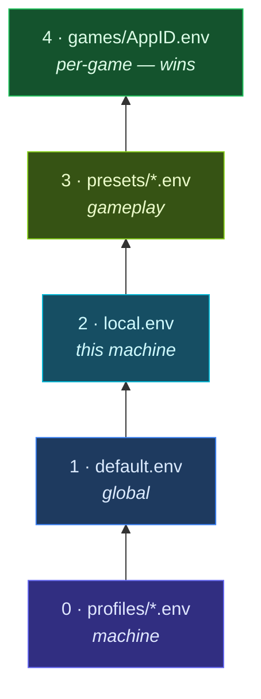

<div align="center">


**Layered launch orchestration for Steam games**

[](LICENSE)
[](launchlayer)
[](launch.d/profiles/)
[](https://github.com/bolens/LaunchLayer/actions/workflows/ci.yml)

</div>

LaunchLayer sits in Steam’s **Launch Options** ahead of `%command%`. It loads machine and per-game settings, runs preflight checks, and assembles a wrapper chain—GameMode, CPU affinity, MangoHUD, Gamescope, and more—before your game starts.

Built for a tuned Linux gaming workstation (7900X3D, RTX 3080 Ti, Wayland / Plasma 6), but auto-detection and profiles make it work across distros, Steam Deck, Flatpak Steam, BSD, and WSL2.

**Requirements:** bash 4.2+, Steam (or a `%command%` game launch argv). Optional tools (`fzf`, `gamescope`, …) enhance the experience but are not required for basic launches.

---

## Contents

| | Section |
|:---:|---------|
| ▶ | [Quick start](#quick-start) |
| ◆ | [Steam launch options](#integrating-with-steam-launch-options) |
| · | [What it does](#what-it-does) |
| ⚙ | [How a launch works](#how-a-launch-works) |
| ≡ | [Configuration](#configuration) |
| ⌨ | [CLI reference](#cli-reference) |
| ▤ | [Interactive TUI](#interactive-tui) |
| ◉ | [Community hub](#community-hub) |
| ⊞ | [System tuning](#system-tuning) |
| / | [Project layout](#project-layout) |
| + | [Optional dependencies](#optional-dependencies) |
| ✓ | [Testing](#testing) |
| § | [License](#license) |

---

## Quick start

<table>
<tr>
<td width="28" align="center">①</td>
<td><strong>Clone to a stable path</strong></td>
</tr>
</table>

```bash
git clone https://github.com/bolens/LaunchLayer.git /mnt/games/config
cd /mnt/games/config
```

<table>
<tr>
<td width="28" align="center">②</td>
<td><strong>Run onboarding</strong></td>
</tr>
</table>

```bash
./launchlayer --setup --completions --symlink --print-launch-option --write-local-config
```

This installs shell completions, adds a `~/.local/bin/launchlayer` shortcut, prints your Steam launch string, and writes `launch.d/local.env` with detected machine defaults. Add `--systemd` for the maintenance timer or `--backup-timer` for scheduled config backups.

<table>
<tr>
<td width="28" align="center">③</td>
<td><strong>Set Steam launch options</strong></td>
</tr>
</table>

Paste the launch string from step ② into each game’s **Launch Options** field. See [Integrating with Steam launch options](#integrating-with-steam-launch-options) for UI paths, Flatpak notes, and verification steps.

<table>
<tr>
<td width="28" align="center">④</td>
<td><strong>Scaffold a per-game config</strong></td>
</tr>
</table>

```bash
./launchlayer --init-appid 2357570 competitive    # by AppID
./launchlayer --init-appid "Overwatch" competitive  # by name
```

Or browse interactively: `./launchlayer --tui`

<table>
<tr>
<td width="28" align="center">⑤</td>
<td><strong>Sanity check</strong></td>
</tr>
</table>

```bash
./launchlayer --doctor
```

If Proton titles misbehave, fix `vm.max_map_count` once—see [System tuning](#system-tuning).

---

## Integrating with Steam launch options

LaunchLayer hooks into Steam by **prefixing** the normal game command. Steam replaces `%command%` with Proton wrappers, the game binary, and any args Steam already knows about; LaunchLayer loads config, runs preflight, builds wrapper chains, then execs that command.

Use the **same launch string on every game** you want managed. Per-game tuning lives in `GAMES_DIR/<AppID>.env`—you do not need different launch options per title.

### 1. Get your launch string

Run onboarding (recommended) or print the string alone:

```bash
./launchlayer --setup --symlink --print-launch-option
# or
./launchlayer --setup --print-launch-option
# or (also printed at the end of doctor)
./launchlayer --doctor
```

Example output:

```
"/mnt/games/config/launchlayer" %command%
```

| Approach | Launch string | Notes |
|----------|---------------|-------|
| **Absolute path** (recommended) | `"/mnt/games/config/launchlayer" %command%` | Most reliable—Steam’s environment often has a minimal `PATH` |
| **Symlink** (after `--setup --symlink`) | `"/home/you/.local/bin/launchlayer" %command%` | Use the full path to the symlink (`realpath ~/.local/bin/launchlayer`); bare `launchlayer` usually fails in Steam |

Rules:

- **Keep `%command%`** at the end. Without it Steam never runs the game binary.
- **Quote the script path** when it contains spaces.
- **Do not** substitute the game `.exe` or Proton command for `%command%`—LaunchLayer receives the full Steam-built argv automatically.
- **Replace** other wrapper prefixes (`gamemoderun %command%`, `mangohud %command%`, etc.) with LaunchLayer; enable those features in config instead (`GAMEMODE=1`, `MANGOHUD=1`, …).

### 2. Paste into Steam

**Per game** (typical workflow—repeat for each title, or copy/paste the same string):

1. Open **Steam** → **Library**
2. Right-click the game → **Properties**
3. In **General**, find **Launch Options**
4. Paste your launch string, e.g. `"/mnt/games/config/launchlayer" %command%`
5. Close Properties and launch the game normally

<details>
<summary>Steam Deck / Big Picture</summary>

On Deck: **Library** → select game → **gear icon** → **Properties** → **General** → **Launch Options**. The same `%command%` string applies.

</details>

### 3. Flatpak Steam

If Steam is installed via Flatpak, the sandbox must read your LaunchLayer install:

- Script under `$HOME` (e.g. `~/launchlayer/…`) → usually works as-is
- Script outside `$HOME` (e.g. `/mnt/games/config`) → grant filesystem access:

```bash
flatpak override --user com.valvesoftware.Steam --filesystem=/mnt/games/config
```

Check access and get a tailored hint:

```bash
./launchlayer --detect-environment
./launchlayer --doctor
```

The `flatpak-steam` profile layers automatically when Flatpak Steam is detected.

### 4. Per-game settings (no launch-option edits)

After the launch string is set once per game, adjust behavior with per-game configs—not by changing Steam’s field again:

```bash
./launchlayer --init-appid 2357570 competitive   # scaffold GAMES_DIR/2357570.env
./launchlayer --edit-appid "Overwatch"             # open in $EDITOR
./launchlayer --show-config 2357570                # resolved layers + launch chain
```

Steam sets `SteamAppId` / `STEAM_APPID` when launching; LaunchLayer uses that to pick `GAMES_DIR/<AppID>.env` (or auto preset when no file exists).

### 5. Verify before or after first launch

**Preview the resolved chain** (terminal—no game start):

```bash
SteamAppId=2357570 ./launchlayer --dry-run %command%
# or
./launchlayer --show-config 2357570
```

**After a real launch**, inspect history:

```bash
./launchlayer --launch-stats 2357570
tail ~/.local/state/launchlayer/launch.log
```

**Health check:**

```bash
./launchlayer --doctor
```

### Troubleshooting

| Symptom | Likely cause | Fix |
|---------|--------------|-----|
| Game starts but LaunchLayer never runs | Launch string missing or wrong game | Confirm **Launch Options** on that title; path must point to the `launchlayer` script |
| Game never starts / instant exit | `%command%` omitted | Use `"/path/to/launchlayer" %command%`—not the script alone |
| `Permission denied` or `No such file` | Bad path or Flatpak sandbox | Use absolute path; for Flatpak Steam see [Flatpak Steam](#3-flatpak-steam) |
| Wrong preset / no per-game config | No `GAMES_DIR` file yet | `./launchlayer --init-appid APPID preset` or `--tui` |
| Double wrappers / odd behavior | Old launch option left in place | Remove `gamemoderun`, `mangohud`, etc. from Steam; configure via LaunchLayer |
| Proton crashes / map errors | Low `vm.max_map_count` | `./launchlayer --sysctl install` — see [System tuning](#system-tuning) |

---

## What it does

| | Area | Behavior |
|:---:|------|----------|
| ≡ | **Layered config** | Plain `KEY=VALUE` files stack: profiles → `default.env` → `local.env` → preset → per-game overrides |
| ◦ | **Auto-detection** | Distro, GPU, compositor, display resolution/VRR, X3D V-Cache CPU mask, native vs Proton |
| ⊛ | **Preflight** | Checks `vm.max_map_count`, shader/compat cache size (optional trim), VRAM, GPU power/processes, disk space, concurrent launches |
| ⚡ | **Runtime tuning** | Network (`ethtool`), PipeWire latency, NVIDIA power mode, Proton/DXVK/VKD3D env |
| ◆ | **VRAM management** | Pause configured systemd units (Sunshine, etc.) during play; resume on exit |
| → | **Launch chain** | `LAUNCH_WRAPPERS_BEFORE` → GameMode → CPU affinity → `game-performance` → `LAUNCH_WRAPPERS` → Gamescope (`--mangoapp` when both Gamescope and MangoHUD) → MangoHUD → game |
| ▤ | **CLI + TUI** | Manage configs, backup/restore, doctor checks, optional [Community hub](#community-hub) |

Use `--dry-run %command%` to print the resolved config and chain without starting the game.

---

## How a launch works

When Steam invokes the script, `run_game_launch` in `lib/launch.sh` runs this pipeline:


<details>
<summary>Step-by-step (text)</summary>

1. **Recover stale state** — Resume VRAM-heavy services left paused after a crash (`lib/vram.sh`)
2. **Resolve AppID** — From `SteamAppId`, `STEAM_APPID`, or launch argv (`lib/config.sh`)
3. **Load layered config** — Profiles → `default.env` → `local.env` → preset or per-game file; then `apply_defaults` and `apply_detected_defaults`
4. **Detect game flags** — Native vs Proton, EAC/BattlEye, engine hints (`lib/steam.sh`)
5. **Auto hardware defaults** — X3D CPU mask, display resolution/refresh for Gamescope (`lib/hardware/`)
6. **Parse extra args** — Split `GAME_EXTRA_ARGS` into argv appended after `%command%`
7. **Preflight checks** — Skipped when `BENCHMARK=1` (`lib/preflight.sh`): sysctl, shader/compat caches, VRAM, GPU power/processes, disk, concurrent launch guard
8. **Tool warnings & anticheat guardrails** — Missing optional tools; warn on risky settings for EAC/BattlEye titles
9. **VRAM hogs** — Optionally pause configured systemd user units with refcount + exit trap (before runtime tuning)
10. **Runtime tuning** — Network (`ethtool`), PipeWire latency, CPU perf profile, NVIDIA power mode, Proton/DXVK/VKD3D env
11. **Build launch chain** — Assemble wrappers per `build_launch_chain` in `lib/runtime.sh`
12. **Exec** — `PRE_LAUNCH_CMD` → run chain + `%command%` + extras → `POST_LAUNCH_CMD`; log to `~/.local/state/launchlayer/launch.log`

</details>

For module-level detail, see [docs/architecture.md](docs/architecture.md).

---

## Configuration

Settings are plain `KEY=VALUE` files. **Later layers override earlier ones.**

### Layer order



| Order | File | Purpose |
|------:|------|---------|
| 0 | `launch.d/profiles/*.env` | Machine profiles (auto-detected or via `LAUNCHLAYER_PROFILES`) |
| 1 | `launch.d/default.env` | Global infrastructure defaults |
| 2 | `launch.d/local.env` | Machine-local overrides (gitignored; from `--write-local-config`; **force-overwrites** profile/default keys) |
| 3 | `launch.d/presets/*.env` | Gameplay preset via per-game `INCLUDE=` **or** auto `standard`/`native` when no per-game file |
| 4 | `games/<AppID>.env` | Per-game overrides in `GAMES_DIR` (wins over everything above) |

**Preset loading:** If `GAMES_DIR/<AppID>.env` exists, only that file is loaded (plus its `INCLUDE=` chain). Auto `standard.env` / `native.env` applies only when no per-game file exists. Per-game files usually start with `INCLUDE=presets/competitive.env` (or another preset) and then override individual keys.

After files load, **runtime detection** fills any still-unset keys: PipeWire latency, network tuning, NVIDIA checks, VRAM hog filtering, disk thresholds, and platform guardrails (Steam Deck, WSL2, containers).

### Where data lives

| Location | Default | Contents |
|----------|---------|----------|
| `LAUNCHLAYER_CONFIG_DIR` | repo root | `launch.d/` shipped layers + optional `local.env` |
| `LAUNCHLAYER_GAMES_DIR` | `~/.local/share/launchlayer/games` | Per-game `<AppID>.env` files |
| `~/.config/launchlayer/` | user prefs | `tui.conf`, `backup.conf`, `hub.conf` |
| `~/.local/state/launchlayer/` | runtime | Launch logs, PID/stamp files (see [Runtime state](#runtime-state)) |

Per-game configs are **not** stored under `launch.d/` in git—only in `GAMES_DIR`. Example: [examples/games/2357570.env](examples/games/2357570.env) (Overwatch 2).

### Auto preset selection

When no per-game `.env` exists:

| | Path |
|:---:|------|
| N | **Native Linux build** → `presets/native.env` |
| P | **Everything else (Proton)** → `presets/standard.env` |

### Presets

| Preset | Use case |
|--------|----------|
| `standard` | Default Proton titles — GameMode on |
| `competitive` | Online / latency-sensitive — extends `standard` with MangoHUD, Gamescope, VRR, VRAM hogs, network tune |
| `lightweight` | 2D / indie — minimal overhead |
| `native` | Native Linux — skips Proton env and cache checks |

Init with: `./launchlayer --init-appid APPID competitive`

### Machine profiles

Profiles in `launch.d/profiles/` layer automatically based on detection, or set explicitly:

```bash
LAUNCHLAYER_PROFILES=steam-deck,flatpak-steam   # comma-separated
# legacy: LAUNCHLAYER_PROFILE=steam-deck
```

| Category | Profiles |
|----------|----------|
| **Distros** | `arch-linux`, `debian`, `fedora`, `suse`, `nixos`, `alpine`, `void`, `gentoo`, `solus`, `clearlinux`, `immutable-linux` |
| **Environment** | `steam-deck`, `flatpak-steam`, `wsl2`, `bsd`, `macos`, `non-systemd` |
| **GPU** | `amd-gpu`, `intel-gpu`, `nvidia-desktop` (auto-layered) |

### Common config keys

Per-game files typically start with `INCLUDE=presets/competitive.env`, then override individual keys:

```bash
# Layering
INCLUDE=presets/competitive.env

# Wrappers and game args
LAUNCH_WRAPPERS="dlss-swapper"
LAUNCH_WRAPPERS_BEFORE=""
GAME_EXTRA_ARGS="-skipintro -nolog"
UNSET_VARS="DXVK_ASYNC VKD3D_CONFIG"

# Hooks
PRE_LAUNCH_CMD=""
POST_LAUNCH_CMD=""

# Flags
FORCE_NATIVE=1    FORCE_PROTON=1
BENCHMARK=1       DEBUG=1

# Features (0/1 unless noted)
GAMEMODE  MANGOHUD  MANGOHUD_CONFIG  MANGOHUD_LOG
GAMESCOPE  GAMESCOPE_W  GAMESCOPE_H  GAMESCOPE_R
GAMESCOPE_ADAPTIVE_SYNC  GAMESCOPE_FSR  GAMESCOPE_FSR_SHARPNESS
VRAM_HOGS  LAUNCH_WATCHDOG  NETWORK_TUNE  PIPEWIRE_LOW_LATENCY
GPU_POWER_CHECK  NVIDIA_POWER_MODE  GAME_PERFORMANCE
DISABLE_CPU_AFFINITY  CONCURRENT_LAUNCH_GUARD

# Preflight thresholds
SHADER_CACHE_CHECK  SHADER_CACHE_MAX_GB  SHADER_CACHE_TRIM
COMPATDATA_CHECK  COMPATDATA_MAX_GB  COMPATDATA_TRIM
VRAM_PREFLIGHT_MIN_MB  DISK_PREFLIGHT_MIN_GB  GPU_VRAM_PROCESS_MIN_MB
VM_MAX_MAP_COUNT_MIN  VM_MAX_MAP_COUNT_FIX

# Proton / GPU (passed through when set)
PROTON_*  DXVK_*  VKD3D_*  __GL_*  __VK_*
```

### Display detection

Cross-compositor probing covers KDE/Plasma, GNOME/COSMIC, Hyprland, Sway, wlroots compositors, and X11 stacks (via xrandr). Compositor IPC probes are gated so inactive tools (e.g. `hyprctl` on KDE) do not false-match. Wayland sessions auto-set `GAMESCOPE_EXPOSE_WAYLAND=0`.

Inspect detection: `./launchlayer --detect-environment`

---

## CLI reference

Run from a terminal—no `%command%` needed. Most game commands accept **AppID or name fragment** (case-insensitive).

Global flags (place before subcommands):

| Flag / variable | Effect |
|-----------------|--------|
| `--quiet`, `-q` | Suppress non-fatal warnings |
| `--verbose`, `-v` | Extra debug output (`DEBUG=1`) |
| `--json` | Machine-readable output (where supported) |
| `LAUNCHLAYER_QUIET=1` | Same as `--quiet` (including during game launch) |
| `LAUNCHLAYER_CONFIG_DIR` | Override config root (parent of `launch.d/`) |
| `LAUNCHLAYER_GAMES_DIR` | Per-game `.env` directory (default: `~/.local/share/launchlayer/games`) |
| `LAUNCHLAYER_PROFILES` | Comma-separated machine profiles (or auto-detect) |
| `NO_COLOR=1` | Disable ANSI colors |

### Setup and health

| Command | Description |
|---------|-------------|
| `--help`, `-h` | Grouped command reference |
| `--version`, `-V` | Version and install paths |
| `--doctor [--json]` | Environment + config health check (includes `--validate-config all`); exits non-zero when issues remain |
| `--setup [--completions] [--systemd] [--backup-timer] [--symlink] [--print-launch-option] [--write-local-config]` | Non-destructive onboarding |
| `--detect-environment [--json]` | Auto-detected platform, GPU, display, tools |
| `--detect-defaults [--json]` | Recommended machine-local settings |
| `--write-local-config [--force] [--dry-run]` | Persist defaults to `launch.d/local.env` |
| `--completions [status\|enable\|disable\|print] [--shell S]` | Shell tab completions |
| `--install-systemd` | Install user **maintenance** timer (`launchlayer-maintenance.timer`) |
| `--backup-timer [install\|enable\|disable\|status\|reinstall] [--dir PATH] [--keep N] [--schedule ON_CALENDAR] [--no-enable]` | Install/manage **backup** timer (`launchlayer-backup.timer`) |
| `--backup-prefs [show\|reset\|set\|set-schedule] [--json] [--reinstall-timer]` | Edit `backup.conf` retention, schedule, and includes |
| `--sysctl [status\|install]` | `vm.max_map_count` helper (install needs root) |

### Games and config

| Command | Description |
|---------|-------------|
| `--list-games [--configured] [--json] [--grep NAME]` | Installed games with native/EAC hints |
| `--init-appid APPID\|NAME [preset] [--force]` | Create per-game config |
| `--bulk-set-include PRESET [--all-configured\|--all-installed] [--grep NAME] [APPID\|NAME...] [--dry-run] [--json]` | Set `INCLUDE=presets/PRESET.env` on many games (TUI: **Games → Bulk change INCLUDE preset**) |
| `--init-unconfigured [--preset P] [--eac-only] [--dry-run]` | Bulk-scaffold missing configs |
| `--prune-uninstalled [--dry-run] [--yes]` | Remove configs for uninstalled games |
| `--show-config APPID\|NAME [--json]` | Resolved layers, settings, launch chain |
| `--edit-appid APPID\|NAME` | Open/create per-game config in `$EDITOR` |
| `--paths APPID\|NAME [--json]` | Shader cache, compatdata, install paths |
| `--validate-config [APPID\|NAME\|all] [--json]` | Lint `.env` files |
| `--scan-anticheat [--update-list]` | Find EAC/BattlEye vs known list |
| `--scan-detections` | Audit heuristic vs list mismatches |

### Runtime and diagnostics

| Command | Description |
|---------|-------------|
| `--status [AppID\|NAME] [--json]` | Runtime state, cache sizes |
| `--show-cpu-topology` | CPU summary + X3D V-Cache CCD range |
| `--cache-report [--min-gb N] [--grep NAME] [--json] [--shader-only\|--compat-only]` | Large cache directories |
| `--launch-stats [AppID\|NAME] [--json]` | Summarize `launch.log` |
| `--dry-run %command%` | Print env + chain without running |
| `--pause-vram-hogs` / `--resume-vram-hogs` | Manual VRAM service control |
| `--cleanup-stale-launch [pid]` | Recover after crash or force-quit |

### Backup and restore

| Command | Description |
|---------|-------------|
| `--export-config [--output PATH] [--include-local] [--no-profiles] [--include-tui] [--json]` | Export config bundle (timestamped `.tar.gz` by default) |
| `--backup-config [--output DIR\|PATH] [--exclude-local] [--no-profiles] [--include-tui] [--json]` | Backup alias with backup-dir defaults |
| `--import-config ARCHIVE [--yes] [--merge\|--replace] [--exclude-local] [--no-profiles] [--include-tui] [--json]` | Restore bundle (dry-run by default; pass `--yes` to apply) |
| `--prune-backups [--dir PATH] [--keep N] [--dry-run] [--json]` | Remove old backup archives |
| `--run-scheduled-backup [--dir PATH] [--keep N] [--json]` | Run backup + prune (used by `launchlayer-backup.timer`) |
| `--tui-prefs [show\|reset\|set] [--json]` | Edit `tui.conf` (fzf height, JSON mode, default preset, …) |
| `--hub-prefs [show\|reset\|set] [--json]` | Edit `hub.conf` (url, publish token, machine label, fingerprint level) |

### Shell completion

Supported shells: **bash**, **zsh**, **fish**, **nushell** (`nu`), **PowerShell** (`pwsh`), and **Oil** (`osh`, reuses bash completions).

```bash
./launchlayer --completions enable              # login shell
./launchlayer --completions enable --shell all
./launchlayer --completions print --shell bash  # for Nix/packaging
./launchlayer --completions enable --shell osh    # Oil shell
./launchlayer --completions enable --shell nu     # ~/.config/nushell/completions/
./launchlayer --completions enable --shell pwsh   # $PROFILE drop-in
```

Disable with `--completions disable`. Unknown flags suggest close matches (“Did you mean …?”).

---

## Interactive TUI

```bash
./launchlayer --tui          # always opens the TUI (interactive terminal required)
launchlayer                  # same when symlinked; also opens TUI with no args when fzf + TTY
```

Requires an interactive terminal. With [fzf](https://github.com/junegunn/fzf) menus are fuzzy lists with a header, border, and reverse layout; without fzf, the same items appear as numbered prompts (`1) …`, `Choice:`).

**On launch** — status banner (two lines, then the main menu):

```
── filter: all │ doctor: 0 issue(s) │ vm.max_map_count: ok
── backup: off │ maintenance: off │ keep newest 7 after backup │ hub: not configured · fp:minimal
```

**Main menu** — header `LaunchLayer 0.9.0` (version from `LAUNCHLAYER_VERSION`). Optional prefix rows appear first when applicable:

```
LaunchLayer 0.9.0                          ← fzf --header
────────────────────────────────────────
Doctor: 2 issue(s)                         ← only when doctor finds issues
▶ Resume: Games                            ← when a previous hub was saved
Games  ← last visit                        ← suffix on the last main hub visited
Config library
Backup & restore
Community hub
System & tools
TUI settings
Quit
```

With **auto-resume** enabled (`TUI settings → Auto-resume last hub`), the saved hub opens immediately instead of showing this menu.

<details>
<summary>Submenus (exact labels from the TUI)</summary>

**Games ›** `(filter: all)`

- Browse & configure game
- Recent games
- Change game filter (`all` / `configured` / `unconfigured`)
- Bulk change INCLUDE preset
- Init unconfigured games
- Prune uninstalled configs

**Games › *Game* › Actions** `(config ok | validation issues | inherits layers)`

- `[View]` Resolved config · Dry-run launch chain · Paths · Launch stats
- `[Edit]` Quick toggles · Advanced config · Clear override · Open in `$EDITOR` · Set preset (re-init)
- `[Manage]` Validate config · Delete per-game config
- `[Hub]` Community configs

**Game picker** (fzf): header `Select a game ([recent] at top, Ctrl-E: editor, Ctrl-D: dry-run, filter=…)`; `[recent]` rows sort to the top; live preview via `--tui-game-preview`.

**Config library › Layers & validation**

- Edit `launch.d/default.env` / `local.env` · Show detected defaults · Write local.env from detection
- Anticheat & detections · Edit machine profile · Edit gameplay preset
- Validate default + presets · Validate all game configs

**Backup & restore ›** `(prune policy │ maint: …)`

- Settings & preferences · Backup actions · Export & import · Prune archives · Backup timer

**Community hub ›** `(url · fp:minimal | not configured · fp:minimal)`

- Hub settings · Fingerprint level: *minimal* · Machine fingerprint · Similar machines
- Recommend configs (pick game) · Publish config · Update shared configs · Delete config by ID · Apply config by ID
- Publish/update flows support optional **config ID** and **include-new** (same as `--config-id` / `--include-new` on the CLI)

**System & tools › Diagnostics & setup**

- Doctor · Detect environment · Runtime status · CPU topology · vm.max_map_count
- VRAM hogs & launch cleanup · Cache report (full / shader-only / compat-only / grep / min GB) · Setup / onboarding

**TUI settings ›** `saved to tui.conf`

- Game picker filter · JSON view output · Auto-resume last hub · Press-enter line threshold
- Cache report min GB · Default init preset · fzf height · fzf preview layout · Reset to defaults

</details>

**Highlights:**

- Breadcrumb headers use ` › ` (e.g. `Games › Overwatch 2 › Quick toggles`)
- Quick toggles show inherited vs per-game override coloring when the terminal supports it
- **Ctrl-E** / **Ctrl-D** in the game picker map to `--edit-appid` and `--dry-run`
- JSON view mode (`TUI settings`) makes view commands emit `--json` output, pretty-printed when `jq`/`python3` is available
- Long output only pauses at “Press Enter to continue…” when it spans `press_enter_lines` (default 8)

**Preferences** in `~/.config/launchlayer/`:

| File | Template |
|------|----------|
| `tui.conf` | `share/launchlayer/templates/tui.conf.example` |
| `backup.conf` | `share/launchlayer/templates/backup.conf.example` |
| `hub.conf` | `share/launchlayer/templates/hub.conf.example` |

Reset via `--tui-prefs reset`, `--backup-prefs reset`, `--hub-prefs reset`, or **TUI settings** / **Backup & restore → Settings & preferences** / **Community hub → Hub settings**.

---

## Community hub

Share per-game configs and discover settings from **similar machines** (GPU, OS, display tier, profiles, Deck/Flatpak/WSL flags). Optional — local launches do not need the hub. Client: `lib/hub/`; backend: Convex app in `hub/`.

**Setup** — copy the template and set your deployment URL:

```bash
mkdir -p ~/.config/launchlayer
cp share/launchlayer/templates/hub.conf.example ~/.config/launchlayer/hub.conf
# hub_url=https://your-deployment.convex.site
# Optional: publish_token, machine_label, fingerprint_level (minimal | standard | detailed)
```

| Command | Description |
|---------|-------------|
| `--hub-fingerprint [--json] [--fingerprint-level minimal\|standard\|detailed]` | Machine descriptor for matching (`minimal` default; override via `hub.conf` or env) |
| `--hub-publish APPID\|NAME [--note TEXT] [--config-id ID] [--all-configured] [--json]` | Upload per-game config(s) (requires `curl`) |
| `--hub-update APPID\|NAME\|CONFIG_ID [--all-configured] [--note TEXT] [--include-new] [--json]` | Update existing shared config(s) for this machine |
| `--hub-delete CONFIG_ID [--yes] [--json]` | Delete a shared config (requires `curl` + publish token when enforced) |
| `--hub-recommend APPID\|NAME [--limit N] [--json]` | Configs from similar machines |
| `--hub-search [--limit N] [--json]` | Machines most like yours |
| `--hub-apply CONFIG_ID [--dry-run] [--json]` | Download and write a shared config (requires `curl` + `jq` or `python3`) |
| `--hub-prefs [show\|reset\|set] [--json]` | Edit `hub.conf` without the TUI |

The TUI exposes the same flows under **Community hub** (main menu) and **[Hub] Community configs** (per-game actions). Bulk `INCLUDE` preset changes use **`--bulk-set-include`** on the CLI or **Games → Bulk change INCLUDE preset** in the TUI.

Deploy or develop the backend from `hub/` (requires [Corepack](https://nodejs.org/api/corepack.html) + pnpm):

```bash
cd hub
corepack enable
pnpm install
pnpm dev      # development — runs convex dev
pnpm run convex:deploy   # production only (or: npx convex deploy)
```

Point `hub_url` in `hub.conf` at your deployment’s HTTP actions URL (e.g. `https://your-deployment.convex.site`).

See [docs/architecture.md](docs/architecture.md) for similarity weights, fingerprint levels, and HTTP routes. **Do not commit** `hub/.env.local`, `hub/.convex/`, or `hub/node_modules/` — they are gitignored; `make check` runs `check-hub-git` to catch accidental staging.

---

## System tuning

### vm.max_map_count (Proton)

Elasticsearch’s package sysctl can reset `vm.max_map_count` to `262144`, which breaks some Proton games:

```bash
./launchlayer --sysctl install
# or manually:
sudo cp share/launchlayer/sysctl/elasticsearch.conf /etc/sysctl.d/
sudo sysctl --system
sysctl -n vm.max_map_count   # expect 2147483642
```

> ⓘ Remove `/etc/sysctl.d/99-proton-vm.conf` if present—it is superseded by `elasticsearch.conf`.

Set `VM_MAX_MAP_COUNT_FIX=1` in config to raise the value at launch when passwordless `sudo` is available.

### Workstation setup (optional)

```bash
sudo ./scripts/setup-workstation-tuning.sh
```

Installs **irqbalance**, enables **btrfs autodefrag** when applicable, and installs the **X3D IRQ affinity** helper + `irq-affinity-x3d.service` when the helper binary is found.

### systemd timers

**Maintenance** — stale launch cleanup + cache report (`launchlayer-maintenance.timer`):

```bash
./launchlayer --install-systemd
# or: ./launchlayer --setup --systemd
```

**Backup** — scheduled config export + prune (`launchlayer-backup.timer`; configure `backup.conf` first):

```bash
./launchlayer --backup-timer install
# or: ./launchlayer --setup --backup-timer
```

Both write user units under `~/.config/systemd/user/` with the resolved script path.

---

## Project layout

```
launchlayer              # ▶ entry point (bash 4.2+)
launch.d/                # ≡ shipped layers: default.env, profiles/, presets/, *.txt lists
  anticheat-appids.txt   # known EAC/BattlEye AppIDs
  native-appids.txt      # known native Linux AppIDs
lib/                     # ⚙ core modules (config, launch, hardware, tui, …)
  hub/                   # ◉ community hub client (fingerprint, HTTP)
hub/                     # ◉ optional Convex backend (pnpm)
share/launchlayer/       # ▣ templates, sysctl, systemd units, completions
examples/games/          # ◆ tracked example per-game configs
scripts/                 # ⊞ workstation setup; check-staged-hub-secrets.sh
test/                    # ✓ bats integration + unit tests
docs/
  architecture.md        # module load order, paths, hub API
  assets/launchlayer.svg # logo (this README)
```

### Runtime state

Under `$XDG_STATE_HOME/launchlayer` (default `~/.local/state/launchlayer/`):

| File | Purpose |
|------|---------|
| `launch.log` | Structured launch history (rotated; default max 5000 lines) |
| `paused-vram-units` | systemd units stopped for VRAM |
| `paused-vram-pids` | PIDs tracked for VRAM hog pause |
| `vram-hog-refcount` | Nested launch refcount |
| `active-launch.pid` | Current game PID |
| `launch-watchdog.pid` | Cleanup subprocess when `LAUNCH_WATCHDOG=1` |
| `x3d-cpus` / `x3d-cpus.meta` | Cached V-Cache CPU mask |
| `shader-cache-check-<AppID>.stamp` | Rate-limit shader cache preflight |
| `compatdata-check-<AppID>.stamp` | Rate-limit compatdata preflight |

---

## Optional dependencies

The script degrades gracefully when tools are missing. Run `--doctor` or `--detect-environment` for distro-aware install hints.

| Tool | Used for |
|------|----------|
| `fzf` | Interactive TUI |
| `gamemoderun` | GameMode CPU governor |
| `game-performance` | CPU perf profile wrapper |
| `gamescope` | Compositor upscaling, VRR |
| `mangohud` | Overlay |
| `taskset` | Pin to X3D V-Cache CCD |
| `nvidia-smi`, `nvidia-settings` | VRAM/power checks |
| `ethtool` | `NETWORK_TUNE` |
| `pw-metadata` | `PIPEWIRE_LOW_LATENCY` |
| `curl` | Community hub HTTP client |
| `jq` or `python3` | Parse hub apply responses |
| systemd user session | `VRAM_HOGS` unit pause/resume |

### Anticheat and native detection

- **`launch.d/anticheat-appids.txt`** — Known EAC/BattlEye AppIDs; guardrails warn on risky settings (`DEBUG=1`, `DXVK_ASYNC`)
- **`launch.d/native-appids.txt`** — Known native Linux builds; skips Proton env unless `FORCE_PROTON=1`
- Heuristics in `lib/steam.sh` also inspect install manifests; `--scan-anticheat` and `--scan-detections` help keep lists accurate

---

## Testing

```bash
make test           # bats integration + unit tests
make check          # shellcheck + check-hub-git + bats
make check-hub-git  # fail if hub secrets are staged
```

Or directly:

```bash
bats test/
shellcheck -x launchlayer lib/*.sh lib/**/*.sh scripts/*.sh
```

---

## License

[CC BY-NC-SA 4.0](LICENSE) — non-commercial use with attribution; derivatives must use the same license.

You may use, modify, and share this project for personal or non-commercial purposes if you credit **bolens**, link to [github.com/bolens/LaunchLayer](https://github.com/bolens/LaunchLayer), and release any derivatives under the same terms. Commercial use requires separate permission.
